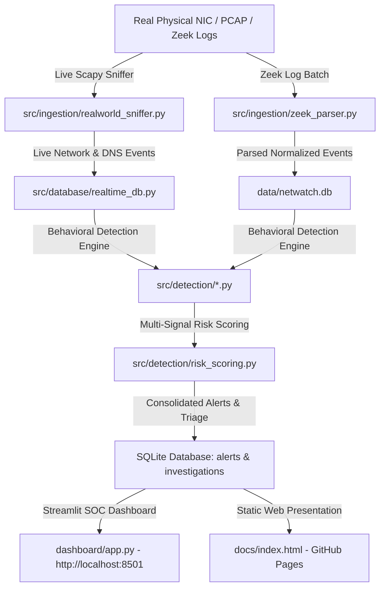

# NetWatch SOC — Real-Time Network Traffic & C2 Detection Lab

> **SAFE SIMULATION — NOT MALWARE**
> This repository is a 100% free, local, open-source Security Operations Center (SOC) platform for analyzing real-world physical network traffic, Zeek logs, PCAPs, and detecting Command-and-Control (C2) beaconing patterns, DNS anomalies, and rare destinations. All simulation and sniffing tools operate safely with zero external API dependencies or malicious capabilities.

---

## 🌐 Live Web App & Deployments

- 💻 **Local SOC Application**: `http://localhost:8501` (Run via Streamlit backend)
- 🌐 **GitHub Pages Interactive Web App**: [https://noobkushal.github.io/C2/](https://noobkushal.github.io/C2/)
- 🐙 **GitHub Repository**: [https://github.com/noobkushal/C2.git](https://github.com/noobkushal/C2.git)

---

## 🔑 Quickstart & 1-Click Launchers (Windows)

The repository includes bundled installers and batch scripts so you can start live network packet scanning right out of the box without manual configuration:

### 1-Click Setup Options

1. **Install Bundled Npcap Driver (Wireshark Driver)**:
   - Double-click **`install_npcap.bat`** (or run `installers/npcap-setup.exe`).
   - Ensures WinPcap API compatibility for physical network card sniffing on Windows.

2. **Launch NetWatch SOC Cockpit (Administrator)**:
   - Right-click **`start_soc.bat`** → Select **Run as Administrator**.
   - Opens local Streamlit server automatically at `http://localhost:8501`.

3. **Log In**:
   - **Administrator Account**: Username `admin` / Password `Admin@123` (Role: `ADMIN`)
   - **Analyst Account**: Username `analyst` / Password `Analyst@123` (Role: `ANALYST`)

---

## 🛡️ Key Features

- **User Authentication & Role-Based Access Control (RBAC)**: Salted SHA-256 password hashing, user session tracking, and granular role enforcement (`ADMIN` vs `ANALYST`).
- **Admin Permission & Governance**: Strictly enforces explicit Admin Consent before initiating real-world live network packet scanning or altering system rules.
- **Real-World Live Physical NIC Packet Sniffer**:
  - Automatically enumerates host physical network cards (`Wi-Fi`, `Ethernet`, `eth0`, `wlan0`).
  - Sniffs actual live IP packets, TCP/UDP flows, and DNS queries using Scapy with Layer 3 socket fallback.
  - Streaming real-time packet feed and automated issue emitter.
- **Multi-Source Zeek Log Parsing**: Supports dynamic `#fields` header parsing for `conn.log`, `dns.log`, `http.log`, and `ssl.log`.
- **C2 Beacon Interval Analysis**: Grouped statistical calculations (mean, median, population stdev, coefficient of variation `CV`) to isolate regular C2 callback channels.
- **DNS Anomaly Engine**: Detects DGA long domain names (>50 chars), high query frequencies, rare single-host domains, and subdomain tunneling.
- **Multi-Signal Risk Scoring**: Consolidates detector signals into unified 0–100 risk scores, severity bands (`LOW`, `MEDIUM`, `HIGH`, `CRITICAL`), and confidence ratings.
- **Enterprise Dark SOC Dashboard**: 11 Streamlit pages styled using an enterprise dark SOC design system (`#0b0f17` canvas, Inter & JetBrains Mono typography).
- **Static Web App (GitHub Pages)**: Pure HTML/JS/CSS client-side interactive presentation deployed via GitHub Actions workflow.

---

## 🏗️ Platform Architecture



---

## 🔒 Security & RBAC Matrix

| Role | Login Credentials | Real-Time Packet Sniffing | Grant/Revoke Consent | Detection Rule Triage | View Reports |
| :--- | :--- | :---: | :---: | :---: | :---: |
| **ADMIN** | `admin` / `Admin@123` | ✅ Yes | ✅ Yes | ✅ Full Edit | ✅ Download |
| **ANALYST** | `analyst` / `Analyst@123` | ❌ No | ❌ No | 👁 Read-Only | ✅ Download |

---

## 📊 Database Schema Summary

| Table | Primary Key | Description |
| :--- | :--- | :--- |
| `users` | `user_id` (UUID4) | User account repository, role (`ADMIN`, `ANALYST`), password hash + salt |
| `sessions` | `session_token` | Active session tokens, user references, expiration timestamps |
| `admin_permissions` | `permission_id` | Governance status (`GRANTED` vs `REVOKED`), granted_by, timestamp |
| `admin_audit_log` | `log_id` (Autoincrement) | Audit history for consent grants, revokes, and security operations |
| `network_events` | `event_id` (UUID4) | Normalized IP flow events from `conn`, `http`, `ssl` logs or live sniffer |
| `dns_events` | `event_id` (UUID4) | Normalized DNS query records from `dns` logs or live sniffer |
| `alerts` | `alert_id` (UUID4) | Correlated security alerts with risk scores and evidence JSON |
| `investigations` | `investigation_id` | Analyst notes, verdicts (`TRUE_POSITIVE`, `FALSE_POSITIVE`), audit history |

---

## ⚙️ Running Locally (Developer Setup)

### 1. Prerequisites
- Python 3.11+ installed.
- Npcap driver installed (run `install_npcap.bat`).

### 2. Installation Commands
```bash
git clone https://github.com/noobkushal/C2.git
cd C2

# Install dependencies
pip install -r requirements.txt

# Run pytest unit test suite (38 tests)
python -m pytest -v

# Launch local SOC dashboard
streamlit run dashboard/app.py
```

### 3. Run Automated Pipeline
```bash
# Run pipeline on synthetic sample dataset
python scripts/run_pipeline.py --sample

# Test real-world live packet sniffer engine
python -m scripts.test_live_sniff
```

---

## ⚖️ Legal & Safety Disclaimer

> **IMPORTANT**: NetWatch SOC is strictly an educational defense and traffic analysis tool designed for network telemetry visualization, security research, and threat detection training. It contains zero exploit payloads, zero automated attack capabilities, and operates in full compliance with network monitoring governance standards.
