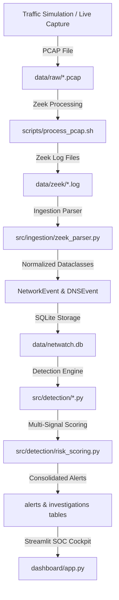

# NetWatch SOC — Network Traffic & C2 Detection Lab

> **SAFE SIMULATION — NOT MALWARE**
> This repository is a 100% free, local, open-source Security Operations Center (SOC) platform for analyzing network traffic PCAPs, Zeek logs, and detecting Command-and-Control (C2) beaconing patterns and DNS anomalies. All simulation tools operate strictly against loopback (`127.0.0.1:8888`) with zero external API dependencies or malicious capabilities.

---

## Architecture



---

## Features

- **Multi-Source Zeek Log Parsing**: Supports dynamic `#fields` header parsing for `conn.log`, `dns.log`, `http.log`, and `ssl.log`.
- **C2 Beacon Interval Analysis**: Grouped statistical calculations (mean, median, population stdev, coefficient of variation `CV`) to isolate regular C2 callback channels.
- **DNS Anomaly Engine**: Detects DGA long domain names (>50 chars), high query frequencies, rare single-host domains, and subdomain tunneling.
- **Risk Scoring & Multi-Signal Correlation**: Consolidates multi-detector signals into unified 0–100 risk scores, severity bands (`LOW`, `MEDIUM`, `HIGH`, `CRITICAL`), and confidence ratings.
- **Enterprise Dark SOC Dashboard**: 11 Streamlit pages styled using an enterprise dark SOC theme inspired by Stitch design system (`#0b0f17` canvas, Inter & JetBrains Mono typography).
- **Offline MITRE ATT&CK Mapping**: Bundles static technique references (e.g. `T1071`, `T1568`, `T1071.004`) qualified with explicit hedge notes.
- **Comprehensive Forensic Evidence Locker**: Built-in reports generator exporting structured JSON/CSV reports and evidence files.

---

## Technology Stack

- **Core**: Python 3.11, SQLite3 (stdlib)
- **Dashboard & Visualization**: Streamlit (>=1.38), Plotly (>=5.22), Pandas (>=2.2)
- **Ingestion & Parsing**: Zeek LTS, PyYAML, Python-dateutil
- **Testing & Tooling**: Pytest (>=8.0), Pytest-cov

---

## Installation & Setup

### 1. Python Virtual Environment

```bash
python -m venv venv
# Linux / WSL2:
source venv/bin/activate
# Windows:
.\venv\Scripts\activate

pip install -r requirements.txt
```

### 2. WSL2 / Ubuntu Setup (Zeek & tcpdump)

```bash
# Add Zeek Official Repository
sudo apt-get update
sudo apt-get install -y curl gnupg2 lsb-release
echo 'deb http://download.opensuse.org/repositories/security:/zeek/xUbuntu_22.04/ /' | sudo tee /etc/apt/sources.list.d/security:zeek.list
curl -fsSL https://download.opensuse.org/repositories/security:/zeek/xUbuntu_22.04/Release.key | gpg --dearmor | sudo tee /etc/apt/trusted.gpg.d/security_zeek.gpg > /dev/null

# Install Zeek and tcpdump
sudo apt-get update
sudo apt-get install -y zeek tcpdump

# Add Zeek to PATH
export PATH=$PATH:/opt/zeek/bin
```

---

## Database Architecture

| Table | Primary Key | Description |
| :--- | :--- | :--- |
| `network_events` | `event_id` (UUID4) | Normalized IP flow events from `conn`, `http`, `ssl` logs |
| `dns_events` | `event_id` (UUID4) | Normalized DNS query records from `dns` logs |
| `alerts` | `alert_id` (UUID4) | Correlated security alerts with risk scores and evidence JSON |
| `investigations` | `investigation_id` | Analyst notes, verdicts (`TRUE_POSITIVE`, `FALSE_POSITIVE`), audit history |
| `detection_rules` | `rule_id` | Configurable detection thresholds and toggle states |

---

## Detection Logic & Risk Scoring

| Signal | Condition | Score Points |
| :--- | :--- | :--- |
| **Repeated connections** | `connection_count >= min_connections` (default 4) | +30 |
| **Low interval variation** | `CV <= max_cv` (default 0.15) | +25 |
| **Fixed destination** | Fixed destination IP:Port tuple | +20 |
| **Rare destination** | Destination contacted by `<= 5%` of hosts | +10 |
| **Unusual port** | Port not in common allowed allowlist | +10 |
| **High frequency** | `connections_per_hour >= high_frequency_threshold` | +5 |

### Severity Bands
- **0 – 29**: `LOW`
- **30 – 59**: `MEDIUM`
- **60 – 79**: `HIGH`
- **80 – 100**: `CRITICAL`

---

## Running the Pipeline

```bash
# 1. Run full pipeline on synthetic sample dataset
python scripts/run_pipeline.py --sample

# 2. Process custom Zeek log directory
python scripts/run_pipeline.py --zeek-dir data/zeek/sample_20260907_120000/

# 3. Launch Streamlit Analyst SOC Dashboard
streamlit run dashboard/app.py
```

---

## Worked Example Alert

```json
{
  "alert_id": "97177280-8a9c-4c28-945a-a10232972a46",
  "timestamp": "2026-09-07T19:37:42Z",
  "source_ip": "192.168.1.100",
  "destination_ip": "10.0.0.99",
  "destination_port": 8443,
  "alert_type": "BEACONING",
  "severity": "CRITICAL",
  "confidence": 0.85,
  "risk_score": 100,
  "reason": "Regular-interval connections (CV=0.0125) with 30 connections; Rare destination 10.0.0.99; Port 8443 not in common allowed ports",
  "evidence": "{\"detectors_fired\": [\"beacon_detection\", \"rare_destination\", \"suspicious_port\"], \"detector_count\": 3, \"signals\": [{\"name\": \"repeated_connections\", \"points\": 30}, {\"name\": \"low_interval_variation\", \"points\": 25}, {\"name\": \"fixed_destination\", \"points\": 20}, {\"name\": \"rare_destination\", \"points\": 10}, {\"name\": \"unusual_port\", \"points\": 10}]}",
  "status": "NEW",
  "first_seen": "2026-09-07T15:37:42Z",
  "last_seen": "2026-09-07T15:52:12Z"
}
```

---

## MITRE ATT&CK Context

> **Relevant ATT&CK Context Disclaimer**:
> Technique potentially relevant to investigation — behavioral detection alone does not confirm this technique was used.

- **T1071 — Application Layer Protocol**: C2 communication over common or non-standard transport protocols.
- **T1568 — Dynamic Resolution**: Fast-flux or beaconing domain resolution patterns.
- **T1071.004 — DNS**: DNS tunneling and DGA query anomalies.

---

## Screenshots Placeholder


---

## Limitations & Future Improvements

### Limitations
- Single-node local SQLite deployment target (<50,000 active events per batch).
- Synthetic HTTP/DNS simulation loopback target; no real malware sample execution.
- Single-user local analyst session; no multi-tenant auth in v1.

### Future Improvements
- Multi-tenant auth and Role-Based Access Control (RBAC).
- Real-time streaming PCAP ingestion via Suricata / Zeek socket listener.
- Machine-learning anomaly scoring (Isolation Forests / Autoencoders).
- Exportable ATT&CK Navigator JSON layers.
